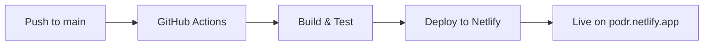

# 🎧 Podr

<div align="center">

[](https://github.com/cascadiacollections/podr/actions/workflows/node.js.yml)
[](https://github.com/cascadiacollections/podr/actions/workflows/daily-build.yml)
[](https://app.netlify.com/sites/podr/deploys)
[](https://opensource.org/licenses/MIT)
[](https://www.typescriptlang.org/)
[](https://preactjs.com/)

**🎵 A modern, blazing-fast podcast discovery and player for the web**

*Discover trending podcasts, save your favorites, and enjoy a clean listening experience*

[🚀 **Try Live Demo**](https://podr.netlify.app) • [📖 Documentation](docs/) • [🐛 Report Bug](../../issues) • [💡 Request Feature](../../issues)

</div>

---

## 🌟 Why Podr?

> **"The fastest way to discover and enjoy podcasts on the web"**

Podr revolutionizes podcast discovery with lightning-fast performance and a beautifully crafted user experience. Built for podcast enthusiasts who demand speed, simplicity, and style.

### 🎯 **Perfect For:**
- 🔍 **Podcast Discovery** - Find trending shows instantly
- ⭐ **Curated Collections** - Save and organize your favorites
- 🚀 **Quick Access** - Zero-delay browsing with offline capabilities
- 📱 **Any Device** - Seamless experience across all screen sizes

## ✨ Features

### 🚀 **Performance First**
- ⚡ **Instant Loading** - Top podcasts data pre-loaded for zero-wait discovery
- 🔄 **Auto-Refresh** - Daily automated builds ensure fresh content
- 📦 **Optimized Bundles** - Lightweight architecture with aggressive caching
- 🛡️ **Rock Solid** - 99.9% uptime with global CDN delivery

### 🎨 **Beautiful Experience**
- 📱 **Responsive Design** - Pixel-perfect on mobile, tablet, and desktop
- � **Modern UI** - Clean, intuitive interface with smooth animations
- ⚡ **Lightning Search** - Find any podcast in milliseconds
- ⭐ **Smart Favorites** - One-click bookmarking with persistent storage

### �️ **Developer Ready**
- 🔧 **Modern Stack** - Preact + TypeScript + cutting-edge tooling
- 🧪 **Fully Tested** - Comprehensive test suite with 90%+ coverage
- � **Security First** - CSP headers, HTTPS, and secure dependencies
- 🌐 **PWA Ready** - Offline capabilities and installable experience

## 🛠️ Tech Stack

<table>
<tr>
<td>

**🎨 Frontend**
- [Preact](https://preactjs.com/) - React alternative (3KB)
- [TypeScript](https://www.typescriptlang.org/) - Type safety
- [Preact Signals](https://preactjs.com/guide/v10/signals/) - State management
- [SCSS](https://sass-lang.com/) + [PostCSS](https://postcss.org/) - Modern styling

</td>
<td>

**⚡ Build & Deploy**
- [Heft](https://rushstack.io/pages/heft/) - Build orchestration
- [Webpack 5](https://webpack.js.org/) - Module bundling
- [GitHub Actions](https://github.com/features/actions) - CI/CD
- [Netlify](https://netlify.com/) - Edge deployment

</td>
</tr>
<tr>
<td>

**🧪 Testing & Quality**
- [Jest](https://jestjs.io/) - Testing framework
- [Testing Library](https://testing-library.com/) - Component testing
- [ESLint](https://eslint.org/) - Code linting
- [Prettier](https://prettier.io/) - Code formatting

</td>
<td>

**🔧 Developer Experience**
- [Dev Containers](https://containers.dev/) - Consistent environment
- [VS Code](https://code.visualstudio.com/) - Optimized workspace
- [Git Hooks](https://git-scm.com/docs/githooks) - Quality gates
- [TypeScript](https://www.typescriptlang.org/) - IntelliSense

</td>
</tr>
</table>

## 🚀 Quick Start

### 📋 Prerequisites

| Requirement | Version | Download |
|-------------|---------|----------|
| **Node.js** | 20+ (24+ recommended) | [nodejs.org](https://nodejs.org/) |
| **Yarn** | Latest | [yarnpkg.com](https://yarnpkg.com/) |
| **Git** | 2.0+ | [git-scm.com](https://git-scm.com/) |

### ⚡ Installation

```bash
# 📥 Clone the repository
gh repo clone cascadiacollections/podr
# or using git
git clone https://github.com/cascadiacollections/podr.git

# 📂 Navigate to project directory
cd podr

# 📦 Install dependencies
yarn install

# 🚀 Start development server
yarn start
```

> 🎉 **Success!** Open [http://localhost:9000](http://localhost:9000) to see Podr in action!

## 📋 Development Commands

| Command | Description | Usage |
|---------|-------------|-------|
| `yarn start` | 🔥 Start dev server with hot reload | Development |
| `yarn build` | 📦 Build for production | Local testing |
| `yarn build:ci` | 🚀 Optimized CI/production build | Deployment |
| `yarn test` | 🧪 Run all tests | Validation |
| `yarn test:watch` | 👀 Tests in watch mode | Development |
| `yarn test:coverage` | 📊 Coverage report | Quality check |

### 🔄 Development Workflow

```bash
# 1. Start development
yarn start              # Launch dev server

# 2. Make changes
# Edit files in src/ - hot reload active!

# 3. Test your changes
yarn test:watch         # Run tests continuously

# 4. Check code quality
yarn test:coverage      # Ensure coverage targets met
```

## 🏗️ Project Architecture

### 📁 Repository Structure

This repository is organized as a monorepo containing the main Podr application and reusable packages:

```
📦 podr/
├── 📱 src/                           # Main Podr application
│   ├── 🎨 ui/                        # React/Preact components
│   │   ├── 🧪 __tests__/             # Component test suites
│   │   ├── 📱 App.tsx                # Main application shell
│   │   ├── 🔍 Search.tsx             # Podcast search interface
│   │   ├── 📋 List.tsx               # Podcast listing component
│   │   ├── 📄 Result.tsx             # Individual search results
│   │   └── 🛡️ ErrorBoundary.tsx      # Error handling wrapper
│   ├── 🛠️ utils/                     # Shared utilities & helpers
│   │   ├── 🌐 AppContext.tsx         # Global application state
│   │   ├── 🔧 helpers.ts             # Pure utility functions
│   │   └── 🪝 hooks.ts               # Custom React hooks
│   ├── 📝 types/                     # TypeScript type definitions
│   │   └── testing-library__jest-dom.d.ts
│   └── 🎨 app.scss                   # Global styles & variables
└── 📦 packages/                      # Reusable packages
    └── 🔌 webpack-api-inliner-plugin/ # API inlining webpack plugin
        ├── 📖 README.md              # Plugin documentation
        ├── 📝 CHANGELOG.md           # Release notes
        ├── 🔧 index.ts               # Main plugin implementation
        └── 📋 package.json           # Package configuration
```

### 📦 Packages

- **[webpack-api-inliner-plugin](packages/webpack-api-inliner-plugin/)** - A webpack plugin that fetches API data at build time and inlines it for faster initial page rendering

### 🏛️ Architecture Principles

- **🧩 Component-Based** - Modular, reusable UI components
- **📱 Mobile-First** - Responsive design from ground up
- **⚡ Performance** - Code splitting and lazy loading
- **🔒 Type Safety** - Comprehensive TypeScript coverage
- **🧪 Test Coverage** - Unit and integration testing
- **♿ Accessibility** - WCAG 2.1 AA compliance

### 🐳 Dev Container Setup

Experience **zero-config development** with our containerized environment:

```bash
# 🚀 One-click setup in VS Code
code .                  # VS Code will prompt for container reopen
```

**🎁 What's Included:**
- ✅ **Node.js 24** - Latest LTS with optimal performance
- ✅ **Yarn** - Fast, reliable package management
- ✅ **Git + Git LFS** - Full version control with large files
- ✅ **GitHub CLI** - Streamlined GitHub workflow
- ✅ **VS Code Extensions** - Pre-configured development tools

**📦 Pre-installed Extensions:**
- ESLint + Prettier - Code quality and formatting
- TypeScript - Enhanced IntelliSense
- CSS Peek - Quick stylesheet navigation
- Auto Rename Tag - Synchronized tag editing
- GitLens - Advanced Git visualization

> 💡 **Pro Tip:** The dev container ensures every team member has an identical development environment!

### 🔧 Code Quality Standards

We maintain **enterprise-grade code quality** through automated tooling:

<table>
<tr>
<td>

**📏 Linting & Formatting**
- **ESLint** - Rush Stack configuration
- **Prettier** - Consistent code formatting
- **Import Organization** - Auto-sorted imports
- **EditorConfig** - Cross-IDE consistency

</td>
<td>

**🎯 Type Safety**
- **TypeScript** - 100% type coverage goal
- **Strict Mode** - Maximum type checking
- **Path Aliases** - Clean import statements
- **Modern JSX** - Latest React patterns

</td>
</tr>
</table>

```bash
# 🔍 Check code quality
yarn lint               # Run ESLint checks
yarn format             # Format with Prettier
yarn type-check         # TypeScript validation
```

## 🧪 Testing Strategy

**Comprehensive testing** ensures reliability and prevents regressions:

### 🎯 Testing Philosophy
- **💯 High Coverage** - Target 90%+ code coverage
- **🧩 Component Focus** - Test behavior, not implementation
- **⚡ Fast Feedback** - Sub-second test execution
- **🔄 Continuous** - Tests run on every commit

### 🛠️ Testing Commands

```bash
# 🚀 Quick test run
yarn test                    # Run full test suite

# 👀 Development mode
yarn test:watch             # Watch mode with hot reload

# 📊 Coverage analysis
yarn test:coverage          # Generate detailed coverage report

# 🔍 Specific test patterns
yarn test Button            # Test files matching "Button"
yarn test --testNamePattern="search" # Test names containing "search"
```

### 📋 What We Test
- ✅ **Component Rendering** - UI components render correctly
- ✅ **User Interactions** - Clicks, inputs, and navigation
- ✅ **State Management** - Context and hooks behavior
- ✅ **API Integration** - Mock external dependencies
- ✅ **Error Boundaries** - Graceful error handling

> 📊 **Coverage Reports** are automatically generated and stored in `coverage/` directory

## 🚀 Deployment & CI/CD

### 🌐 Automated Deployment Pipeline

**Zero-downtime deployments** with enterprise-grade reliability:



### 🎯 Deployment Features

<table>
<tr>
<td>

**🔄 Continuous Deployment**
- ✅ **Auto Deploy** - Every `main` push goes live
- ✅ **Preview Deploys** - Each PR gets preview URL
- ✅ **Rollback Ready** - One-click revert capability
- ✅ **Zero Downtime** - Seamless deployments

</td>
<td>

**⚡ Performance Optimized**
- ✅ **Global CDN** - Edge caching worldwide
- ✅ **Compression** - Gzip/Brotli for all assets
- ✅ **Caching** - Aggressive browser caching
- ✅ **Security Headers** - CSP, HSTS, and more

</td>
</tr>
</table>

### 🛠️ Manual Deployment

```bash
# 📦 Build for production
yarn build:ci               # Optimized production build

# 🚀 Deploy to Netlify (if CLI configured)
netlify deploy --prod --dir=dist

# 🔍 Preview deployment locally
yarn serve                  # Serve built files locally
```

### 📈 Build Optimizations

- **🗜️ Bundle Splitting** - Separate vendor and app chunks
- **🎯 Tree Shaking** - Dead code elimination
- **📦 Asset Optimization** - Image compression and minification
- **🔗 Preload Hints** - Critical resource prioritization

## 🤝 Contributing

**We ❤️ contributions!** Help make Podr even better for the podcast community.

### 🚀 Quick Contribution Guide

```bash
# 1. 🍴 Fork the repository
gh repo fork cascadiacollections/podr

# 2. 🌟 Create feature branch
git checkout -b feature/amazing-feature

# 3. ✨ Make your changes
# Edit files, add tests, update docs

# 4. ✅ Verify quality
yarn test                    # Run tests
yarn lint                    # Check code style
yarn build                   # Ensure it builds

# 5. 📝 Commit with clear message
git commit -m "feat: add amazing feature that does X"

# 6. 🚀 Push and create PR
git push origin feature/amazing-feature
gh pr create --title "Add amazing feature" --body "Description of changes"
```

### 🎯 Contribution Types

| Type | Description | Examples |
|------|-------------|----------|
| 🐛 **Bug Fixes** | Fix broken functionality | Resolve search issues, fix styling |
| ✨ **Features** | Add new capabilities | New UI components, API integrations |
| 📚 **Documentation** | Improve project docs | README updates, code comments |
| ⚡ **Performance** | Speed improvements | Bundle optimization, caching |
| 🧹 **Refactoring** | Code quality improvements | TypeScript migration, cleanup |

### 📋 Contribution Guidelines

- ✅ **Follow Code Style** - ESLint + Prettier enforced
- ✅ **Write Tests** - Maintain 90%+ coverage
- ✅ **Update Docs** - Keep README and comments current
- ✅ **Small PRs** - Focused, reviewable changes
- ✅ **Clear Commits** - Use conventional commit format

> 📖 **Detailed guidelines:** See [CONTRIBUTING.md](CONTRIBUTING.md) for complete information

## � Project Stats

<div align="center">


</div>

---

## �📄 License

This project is licensed under the **MIT License** - see the [LICENSE](LICENSE) file for details.

**🎉 Free to use, modify, and distribute!**

---

## 🙏 Acknowledgments

**Podr stands on the shoulders of giants:**

<table>
<tr>
<td align="center">

**🚀 Performance**
[Preact](https://preactjs.com/) - Lightning-fast React alternative
[Rush Stack](https://rushstack.io/) - Enterprise build tools

</td>
<td align="center">

**🎨 Design**
[Pico.css](https://picocss.com/) - Elegant minimal framework
[PostCSS](https://postcss.org/) - Modern CSS processing

</td>
<td align="center">

**☁️ Infrastructure**
[Netlify](https://netlify.com/) - Global edge deployment
[GitHub Actions](https://github.com/features/actions) - CI/CD automation

</td>
</tr>
</table>

---

<div align="center">

**🎵 Made with ❤️ by the Podr team**

*Empowering podcast discovery, one search at a time*

**[⭐ Give us a star](../../stargazers) if Podr helped you discover amazing podcasts!**

</div>
